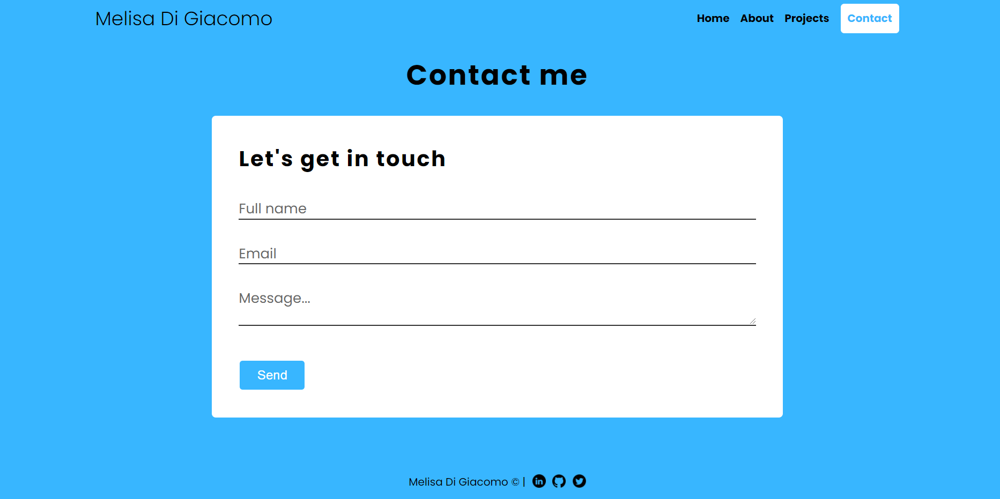

# Contact Form
* Made a responsive contact form usign HTML, CSS and JS.

## [Link Here!](https://melisadigiacomo.github.io/contact-form/)

## Resources Used
&nbsp;
&nbsp; 
&nbsp;

## Contact Form
### Characteristics:
* Responsive: has 4 breakpoints: desktop, laptop, tablet and mobile.
* Functional: uses an API to manage the messages sent.
* Validated: validates required fields and email adress using JS.
* Secure: has a honeypot and encodes my email adress within the API. 

